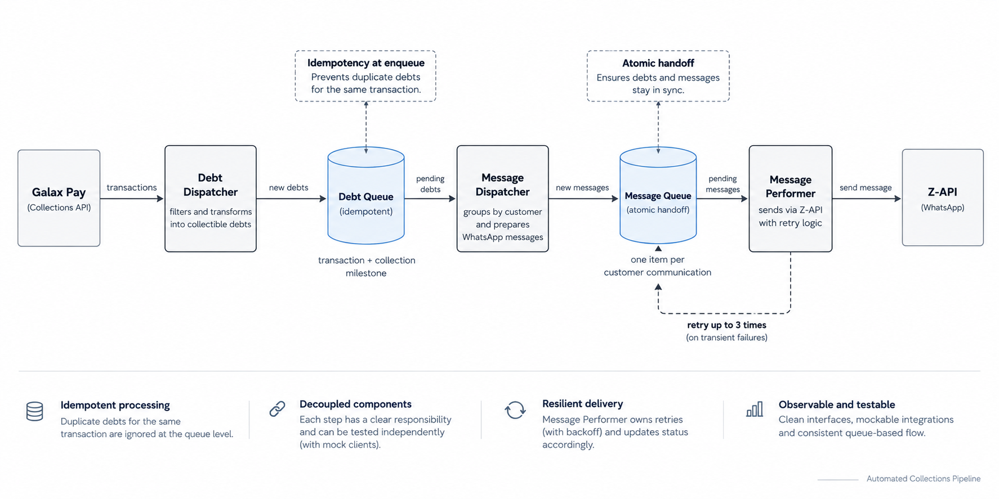

# Automated Collections Pipeline

A Python-based automated collections pipeline designed around queue-driven processing, idempotency, transactional consistency, and clear separation of responsibilities.

## About This Project

This repository is a **simplified and sanitized reconstruction of an automation architecture I originally designed for a real collections process in a corporate environment**.

The original solution operated within an enterprise ecosystem and included company-specific infrastructure, integrations, configurations, operational requirements, and proprietary code that cannot be shared publicly.

This version intentionally removes those details and reduces the process to its essential engineering concepts.

It is **not a copy of the original production code**. Instead, I rebuilt the core architecture in Python to demonstrate the design decisions behind the original automation in a small, readable, and self-contained project.

The implementation intentionally avoids RPA platforms so the underlying software engineering concepts are visible directly in the code.

---

## Business Context — Where My Automation Career Started

This project has a special meaning to me because it reconstructs the architecture behind the **first automation I ever built**.

At the time, I was an intern at a small company, and the collections team had a major operational problem: contacting customers was almost entirely manual. Completing a full collection cycle across the customer base could take weeks.

WhatsApp was the natural communication channel because it is the dominant instant messaging platform in Brazil. However, using the official API at the time was both expensive and relatively complex for a small company. The original solution therefore used a third-party WhatsApp API.

This decision had a significant impact on cost. With a volume of approximately **12,000 messages per month**, a per-message model at roughly **R$0.40 per message** would represent around **R$4,800 per month**. The selected integration instead operated at a fixed cost of approximately **R$90 per month**.

But the largest impact was operational.

Before the automation, **six of the eight people in the collections team were primarily dedicated to manual collection activities**. After the process was automated, two people remained responsible for supervising the automation and handling customer questions and exceptions.

A complete collection cycle that previously took **weeks could now be executed in minutes**. The company subsequently saw a **reduction of more than 30% in delinquency**, as the new process made it possible to contact customers consistently and at the appropriate points throughout the collection cycle.

For me, the impact was personal as well.

Although this was the **first automation project of my career**, I was responsible for it end-to-end. As an intern, I independently handled the process analysis, requirements gathering, solution design, development, deployment, and ongoing maintenance.

My ownership of the solution also outlasted my time at the company. I continued maintaining and supporting the automation for years after leaving, as the process remained part of their day-to-day operations.

Seeing a relatively small automation fundamentally change an entire business process — and then remain valuable enough to keep running for years — was what made me want to become an **Automation Engineer**.

The production implementation evolved within the company's environment over time. This repository does not reproduce that proprietary system. Instead, it is a **simplified and sanitized reconstruction** of its core architecture, rebuilt in Python so the engineering decisions behind the original solution can be inspected, tested, and discussed publicly.

## Overview

The pipeline identifies pending customer debts, determines which ones should trigger a collection event, groups eligible debts by customer, prepares the complete communication, and delivers it through WhatsApp.

The simplified implementation integrates with:

- **Galax Pay / Celcoin** for retrieving pending boleto transactions.
- **Z-API** for WhatsApp delivery.

Both integrations also have mock implementations, allowing the complete pipeline to run locally without credentials or external API calls.

---

## Architecture



```text
                    ┌──────────────────────┐
                    │      Galax Pay       │
                    │   Real / Mock API    │
                    └──────────┬───────────┘
                               │
                               ▼
                    ┌──────────────────────┐
                    │    DebtDispatcher    │
                    │                      │
                    │ Collection schedule  │
                    │ Event idempotency    │
                    └──────────┬───────────┘
                               │
                               ▼
                    ┌──────────────────────┐
                    │ Collectible Debt     │
                    │ Queue                │
                    │                      │
                    │ One item per debt    │
                    │ collection event     │
                    └──────────┬───────────┘
                               │
                               ▼
                    ┌──────────────────────┐
                    │ MessageDispatcher    │
                    │                      │
                    │ Groups by customer   │
                    │ Prepares messages    │
                    └──────────┬───────────┘
                               │
                               ▼
                    ┌──────────────────────┐
                    │ Collection Message   │
                    │ Queue                │
                    │                      │
                    │ One item per         │
                    │ customer message     │
                    └──────────┬───────────┘
                               │
                               ▼
                    ┌──────────────────────┐
                    │ MessagePerformer     │
                    │                      │
                    │ Delivery + retries   │
                    └──────────┬───────────┘
                               │
                               ▼
                    ┌──────────────────────┐
                    │        Z-API         │
                    │   Real / Mock API    │
                    └──────────┬───────────┘
                               │
                               ▼
                           WhatsApp
```

The production environment that inspired this project contained additional enterprise-specific components and operational concerns. They are intentionally omitted here to keep the repository focused on the architecture and engineering fundamentals.

---

## Why Two Queues?

The two queues represent different transactional units.

### Collectible Debt Queue

Each item represents a specific debt reaching a specific collection milestone.

For example:

```text
transaction 84721 at day -5 → 84721:-5
transaction 84721 at day  0 → 84721:0
transaction 84721 at day  5 → 84721:5
```

This allows the same unpaid debt to legitimately generate multiple collection events while preventing the same event from being processed twice.

### Collection Message Queue

Customers may have multiple debts requiring collection on the same day.

Instead of treating each debt as an independent WhatsApp process, the `MessageDispatcher` groups pending events by customer and creates one communication containing all currently eligible charges.

Once that message has been successfully persisted, responsibility moves from the debt queue to the message queue.

The message creation and completion of its source debt events happen inside the **same SQLite transaction**.

Either both operations succeed, or neither does.

---

## Collection Schedule

A pending debt becomes eligible when its distance from the due date matches:

```python
COLLECTION_DAYS = {-5, 0, 5, 10, 15}
```

Meaning:

| Day | Action |
|---:|---|
| -5 | 5 days before due date |
| 0 | Due date |
| 5 | 5 days overdue |
| 10 | 10 days overdue |
| 15 | 15 days overdue |

The Galax Pay client retrieves pending boleto transactions from the relevant date window, but it does **not** decide whether a debt should be collected.

That responsibility belongs to the business layer.

---

## Idempotency

Idempotency exists at both queue boundaries.

### Debt Event

A collection event is identified by:

```text
transaction_id + collection_day
```

Example:

```text
84721:5
```

This means transaction `84721` may legitimately be processed at different collection milestones, but the day-5 event cannot be created twice.

### Customer Message

A customer message is identified from:

```text
customer_id + sorted(source_event_keys)
```

The resulting identity is hashed with SHA-256.

This ensures that the exact same group of source events cannot accidentally generate duplicate message queue items.

---

## Message Preparation

The `MessageDispatcher` prepares all customer-facing content before creating the second queue item.

A message queue item already contains:

- Customer phone numbers
- Main message
- Prepared charge messages
- Boleto bank lines
- Source event keys
- Idempotency key
- Processing metadata

This keeps the `MessagePerformer` intentionally simple.

It does not know about Galax Pay transactions, debt rules, currency formatting, due-date semantics, or customer grouping.

Its responsibility is delivery.

---

## Failure Handling

Retries happen at the **individual outbound message level**, rather than replaying the entire customer communication.

Each outbound message may be attempted up to three times.

If a later message fails temporarily, messages that were already delivered successfully are not repeated during that processing execution.

If the same message fails three times, the corresponding message queue item is marked as:

```text
FAILED
```

Successful queue items are marked:

```text
PROCESSED
```

The Z-API integration uses its native delay capability for regular text messages, with a randomized delay between 1 and 10 seconds.

---

## Galax Pay Integration

The real Galax Pay client handles:

- API authentication
- Bearer token management
- Pending boleto filtering
- Date-window filtering
- Pagination
- Token refresh after an unauthorized response
- HTTP failures
- Empty result handling
- Unexpected response validation

Collection eligibility remains outside the API client.

This keeps provider-specific concerns separated from business rules.

---

## External API Documentation

This project integrates with two external services. The implementations were built against their respective API documentation.

### Galax Pay / Celcoin

Used as the source of customer and pending transaction data.

- API Documentation: [Galax Pay / Celcoin API](https://docs.prod.cloud.galaxpay.com.br/)
- Transactions endpoint: [List Transactions](https://docs.prod.cloud.galaxpay.com.br/transactions/list)

The integration uses OAuth 2.0 authentication and the `transactions.read` scope to retrieve pending transactions within the collection window.

### Z-API

Used as the WhatsApp delivery provider.

- API Documentation: [Z-API Documentation](https://developer.z-api.io/)
- Security / Authentication: [Security](https://developer.z-api.io/security/introduction)
- Send Text Message: [Send Text](https://developer.z-api.io/message/send-text)
- Send Copy-Code Button: [Send Button OTP](https://developer.z-api.io/message/send-button-otp)

The `MessagePerformer` uses these endpoints to send the prepared customer message and each payment code while keeping delivery concerns isolated from the rest of the pipeline.

---


## Demo and Real Modes

The repository can be executed without access to the original corporate environment.

### Demo

```env
PIPELINE_MODE=demo
```

Uses:

```text
MockGalaxPayClient
        ↓
Core pipeline
        ↓
MockZApiClient
```

No credentials are required and no external messages are sent.

Demo mode is the default.

### Real Integrations

```env
PIPELINE_MODE=real
```

Uses:

```text
RealGalaxPayClient
        ↓
Core pipeline
        ↓
RealZApiClient
```

This mode demonstrates how the simplified pipeline connects to the external providers used by this implementation and requires valid API credentials.

---

## Configuration

Create a `.env` file based on `.env.example`:

```env
PIPELINE_MODE=demo

DEMO_PHONE=5511999999999

GALAXPAY_ID=
GALAXPAY_HASH=

ZAPI_INSTANCE_ID=
ZAPI_INSTANCE_TOKEN=
ZAPI_CLIENT_TOKEN=
```

The real `.env` file is excluded from version control.

---

## Running the Project

Create and activate a virtual environment, then install the dependencies:

```bash
pip install -r requirements.txt
```

Run the pipeline:

```bash
python main.py
```

Without additional configuration, the application runs in safe demo mode.

---

## Tests

Run the test suite with:

```bash
python -m pytest -v
```

The tests cover core behaviors including:

- Collection eligibility
- Debt-event idempotency
- Queue persistence
- Customer grouping
- Message idempotency
- Atomic transfer between queues
- Transaction rollback
- Message-level retry behavior
- Failed queue item handling
- Galax Pay authentication
- Galax Pay request filtering
- Pagination
- Token refresh
- API error handling

External HTTP behavior is mocked in automated tests, so no real credentials are required.

---

## Design Principles

This simplified implementation intentionally emphasizes:

- Clear separation of responsibilities
- Dependency inversion through client interfaces
- Queue-based processing
- Explicit transactional boundaries
- Idempotent operations
- Failure isolation
- Provider-independent business rules
- Testable external integrations
- Safe local execution

The purpose of this repository is **not to reproduce the full enterprise solution**.

Its purpose is to provide a concise, sanitized implementation of the architecture and engineering principles behind a real automation system, making those decisions easy to inspect, run, test, and discuss.
